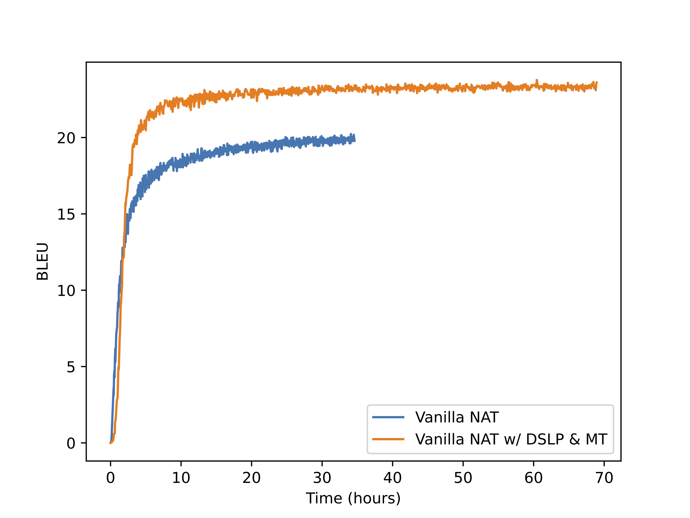

Implementation for paper:

Multi-granularity Optimization for Non-autoregressive Translation (To appear in EMNLP 2022)

<!-- [Paper Link](https://arxiv.org/abs/2110.07515) -->

<!-- ## Replication   -->

## Setup
```
pip install -e . 
pip install tensorflow tensorboard sacremoses nltk Ninja omegaconf
pip install 'fuzzywuzzy[speedup]'
pip install hydra-core==1.0.6
pip install sacrebleu==1.5.1
pip install git+https://github.com/dugu9sword/lunanlp.git
```

## Experimental Details
### Hyperparameters
#### Pretrain stage
|                             	| EN<->RO 	| EN<->DE 	|
|-----------------------------	|---------	|---------	|
| --validate-interval-updates 	| 300     	| 300     	|
| number of tokens per batch  	| 32K     	| 128K    	|
| --dropout                   	| 0.3     	| 0.1     	|
| --max-update                   	| 300k     	| 300k     	|
#### MgMO stage
|                             	| EN<->RO 	| EN<->DE 	|
|-----------------------------	|---------	|---------	|
| --validate-interval-updates 	| 300     	| 500     	|
| number of tokens per batch  	| 256     	| 1024    	|
| --dropout                   	| 0.1     	| 0.1     	|
| --lr-scheduler                   	| fixed    	| fixed     	|
| --lr             | 2e-6 | 2e-6 |
### Arguments
|Argument	|Description	|
|---------------	|------------------------------------------------	|
| --n-sample 	| Number of samples in the search space      	|
| --reward-alpha  	| Coefficient for balancing the sentence probability     	|
| --max-length-bias         	| Max deviation of the predicted length to the golden length during training    	|
| --null-input | Set for N&P mode (default) |
| --rm-scale | The gamma for controling the granularity size |
| --len-loss | Set to enable length loss during training |


### Training:
We provide a script (run.sh) for replicating the results on WMT'16 EN->RO task. For other directions, you need to adjust the data path and corresponding hyper-paramters where necessary.


<!-- 
WMT16-ENRO
```bash
python3 train.py data-bin/wmt14.en-de_kd --source-lang en --target-lang de  --save-dir checkpoints  --eval-tokenized-bleu \
   --keep-interval-updates 5 --save-interval-updates 500 --validate-interval-updates 500 --maximize-best-checkpoint-metric \
   --eval-bleu-remove-bpe --eval-bleu-print-samples --best-checkpoint-metric bleu --log-format simple --log-interval 100 \
   --eval-bleu --eval-bleu-detok space --keep-last-epochs 5 --keep-best-checkpoints 5  --fixed-validation-seed 7 --ddp-backend=no_c10d \
   --share-all-embeddings --decoder-learned-pos --encoder-learned-pos  --optimizer adam --adam-betas "(0.9,0.98)" --lr 0.0005 \ 
   --lr-scheduler inverse_sqrt --stop-min-lr 1e-09 --warmup-updates 10000 --warmup-init-lr 1e-07 --apply-bert-init --weight-decay 0.01 \
   --fp16 --clip-norm 2.0 --max-update 300000  --task translation_glat --criterion glat_loss --arch glat_sd --noise full_mask \ 
   --concat-yhat --concat-dropout 0.0  --label-smoothing 0.1 \ 
   --activation-fn gelu --dropout 0.1  --max-tokens 8192 --glat-mode glat \ 
   --length-loss-factor 0.1 --pred-length-offset 
``` -->


### Evaluation
We select the best checkpoint for evaluation based on the validation BLEU scores. We set the length beam as 5 for inference. See `run.sh' for details.

<!-- ```bash
fairseq-generate data-bin/wmt14.en-de_kd  --path PATH_TO_A_CHECKPOINT \
    --gen-subset test --task translation_lev --iter-decode-max-iter 0 \
    --iter-decode-eos-penalty 0 --beam 1 --remove-bpe --print-step --batch-size 100
```
**Note**: 1) Add `--plain-ctc --model-overrides '{"ctc_beam_size": 1, "plain_ctc": True}'` if it is CTC based; 2) Change the task to `translation_glat` if it is GLAT based. -->


<!-- 
## Training Efficiency
We show the training efficiency of our DSLP model based on vanilla NAT model. Specifically, we compared the BLUE socres of vanilla NAT and vanilla NAT with DSLP & Mixed Training on the same traning time (in hours). 

As we observed, our DSLP model achieves much higher BLUE scores shortly after the training started (~3 hours). It shows that our DSLP is much more efficient in training, as our model ahieves higher BLUE scores with the same amount of training cost.



We run the experiments with 8 Tesla V100 GPUs. The batch size is 128K tokens, and each model is trained with 300K updates. -->
